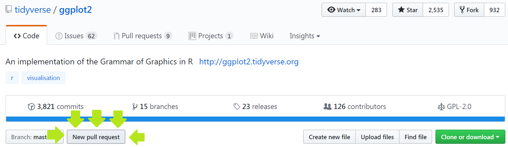
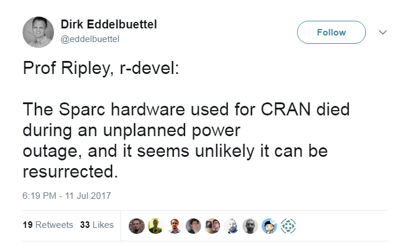
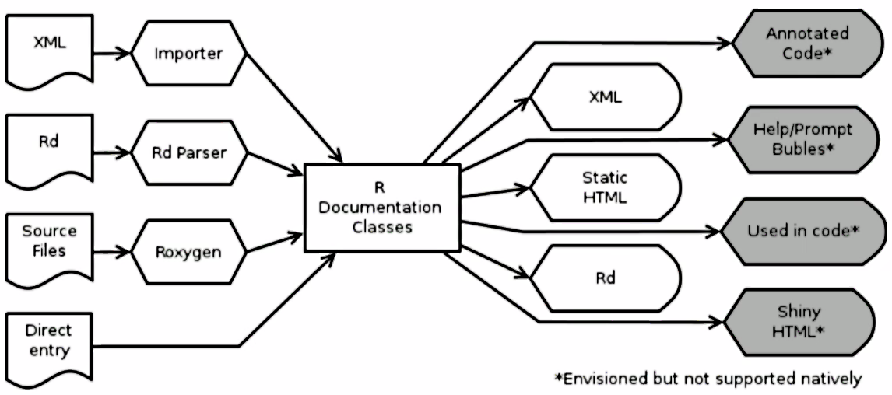
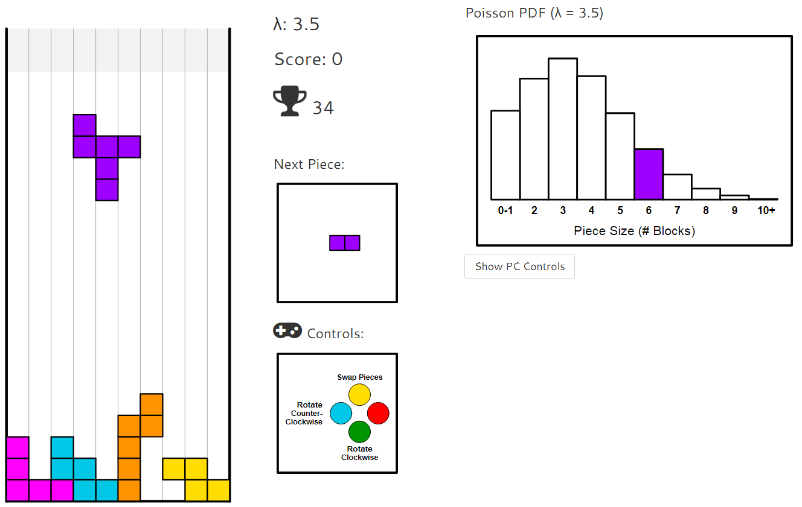
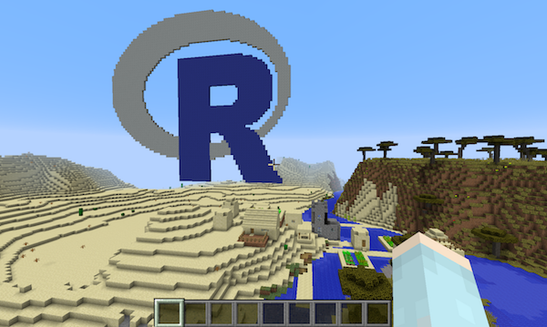
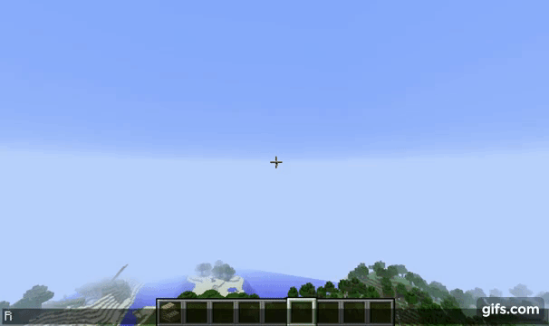
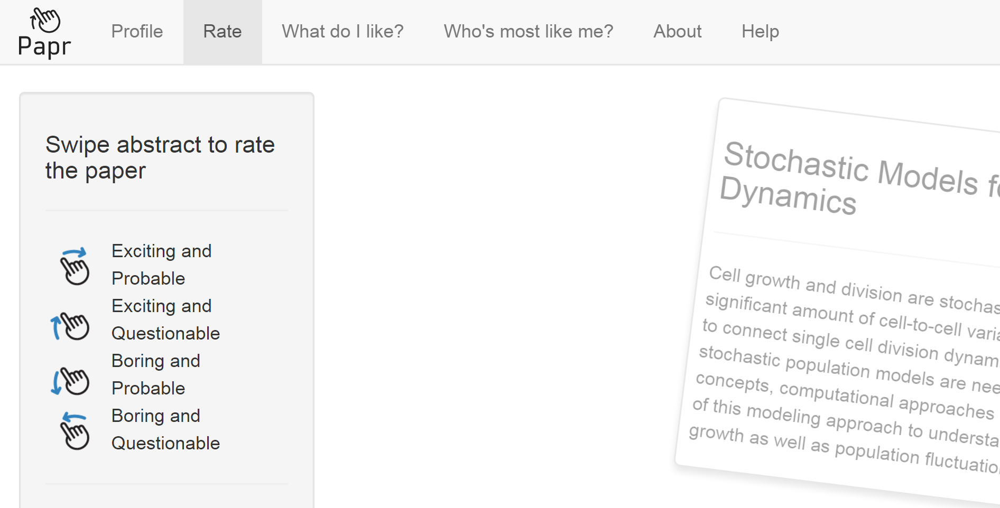

```{r setup, include = FALSE}
options(htmltools.dir.version = FALSE )
```

background-image: url(images/user-sign.jpg)
background-size: cover

???

## Contents

1. useR!2017 conference
  - event itself (DS)
  - inclusivity of conference (EK)
  - community (EK)
2. Packages
  - 20 years of CRAN (DS)
  - package highlights (DS/DV)
  - package highlights (EK)
3. future plans
  - within R / R community (DS/EK)
  - for WRUG (DS)
  
NB: more photos on the conference web site.

---
background-image: url(https://www.user2017.brussels/uploads/_full/deel-2-web-13.jpg)
background-size: cover
???
Breakout room
---
background-image: url(https://www.user2017.brussels/uploads/_full/sfeer-dag-3-87.jpg)
background-size: cover
???
Breakout room full
---
background-image: url(https://www.user2017.brussels/uploads/_full/deel-2-web-78.jpg)
background-size: cover
???
Plenary room
---
background-image: url(https://www.user2017.brussels/uploads/_full/dag-2-sfeer-37.jpg)
background-size: cover
???
Plenary room full
---
background-image: url(images/atomium.jpg) 
background-size: cover
---
background-image: url(images/dinner.jpg)
background-size: cover
---
background-image: url(images/tea.png)
background-size: contain
background-position: 50% 15%
---
class: fullpage

.pull-left[
### Welcoming and inclusive

- newbies session
- 25 diversity scholarships
- transport for people with impairments
- breast-feeding area
- quiet zone
- reasonable fees for students
- childcare
- Heather Turner / Forwards / R Foundation
]

???

EK: Welcoming and inclusive / People come

--

.pull-right[
### People come

&nbsp;

- 1161 attendees
- 54 countries
- 941 litres of beer

]

---

background-image: url(https://image.slidesharecdn.com/rthenandnow-microsoftsponsortalk-170705092253/95/r-then-and-now-9-638.jpg?cb=1499246642)
background-size: contain

???

EK: R ecosystem

---

class: center, bottom, section
background-image: url(https://pbs.twimg.com/media/DD98lZPW0AEaXP0.jpg:large)
background-size: contain
background-position: 50% 0%

[RLadies.org](https://rladies.org) .secondary[|]
[@RLadiesGlobal](https://twitter.com/RLadiesGlobal) .secondary[|]
[@RLadiesLondon](https://twitter.com/RLadiesLondon)

???

EK: R-Ladies

---
class: middle

# .primary[R-Ladies .secondary[`<-`]]

Worldwide organization that promotes gender diversity in the R community via meetups and mentorship in a friendly and safe environment

20+ countries .secondary[|] 45+ cities .secondary[|] 6000+ members

???

EK: R-Ladies

---

# Collaborative coding.secondary[\*]

- Step-by-step on contributing to package development, especially on GitHub

- If you're here, you're ready to contribute to R!



.footnote[.secondary[\*] _Charlotte Wickham, Oregon State University & DataCamp_ ([slides][CWslides])]

[CWslides]: http://cwick.co.nz/talks/collab-code-user17/

???

EK: collaborative coding

---
layout: true
# 20 years of CRAN.secondary[\*]

---
<dl>
  <dt>1976</dt>
  <dd>“At the beginning was S”</dd>
  
  <dt>1992</dt>
  <dd>R development begins</dd>
  
  <dt>1997</dt>
  <dd>R Core team and CRAN founded</dd>
  
  <dt>2000 (February 29)</dt>
  <dd>R-1.0.0 released (compatible with S3)</dd>
  
  <dt>2013</dt>
  <dd>R-3.0.0 released</dd>
</dl>

.footnote[.secondary[\*] _Uwe Ligges, R Core_ ([video][cran])]

[cran]: https://channel9.msdn.com/Events/useR-international-R-User-conferences/useR-International-R-User-2017-Conference/KEYNOTE-20-years-of-CRAN

???

DAS: 20 years of CRAN

---

**11,100** packages depend on other packages that depend on other packages that depend on other packages...

Packages with >1000 reverse dependencies:
- knitr
- testthat
- Rcpp
- MASS .comment[\>75% of all packages]
- Matrix  .comment[\>75% of all packages]
- survival .comment[\>75% of all packages]

.footnote[.secondary[\*] _Uwe Ligges, R Core_ ([video][cran])]

---
layout: false
class: fullpage, middle



???

DAS: Tweet about Sparc (Solaris) hardware

---
layout: true

# New R documentation.secondary[\*]

???

DAS

- R Documentation Task Force
- dynamic documentation
- **parsetools** and **documentation** packages  

---

Documentation stored/manipulated as S4 objects



.footnote[.secondary[\*] _Andrew Redd, University of Utah_ ([video][Rdocs])]

[Rdocs]: https://channel9.msdn.com/Events/useR-international-R-User-conferences/useR-International-R-User-2017-Conference/Updates-to-the-Documentation-System-for-R

---

```r
hw <- 
function( greet = "Hello" #< A greeting 
        , who   = "World" #< who to greet.
        ){
    #! A more complicated hello world
    print(paste(greet, who))
    #< Called for the side effect of printing, 
    #^ but returns the pasted arguments invisibly.
}
```
Implicit unit testing
```r
if (FALSE) {#@testing
  ... }
```

.footnote[.secondary[\*] _Andrew Redd, University of Utah_ ([video][Rdocs])]

---
layout: false

# Teaching data science to new useRs.secondary[\*]

Teaching data science to first-year undergraduates at Duke

- “**tidyverse** first”
- RStudio instances
- Reproducibility with R Markdown
- Version control with GitHub
- Supplement with DataCamp and [**learnr**] package

&nbsp;

.footnote[.secondary[\*] _Mine Çetinkaya-Rundel, Duke University & RStudio_ ([video][mcr link])]

[**learnr**]: https://rstudio.github.io/learnr/
[mcr link]: https://channel9.msdn.com/Events/useR-international-R-User-conferences/useR-International-R-User-2017-Conference/KEYNOTE-Teaching-data-science-to-new-useRs

???

DAS: teaching new useRs

---
class: center, middle, inverse, section

# Packages

---
class: fullpage

## [**poissontris**]: Shiny game



[**poissontris**]: https://github.com/openanalytics/poissontris

???

DAS

Maybe do a live demo at the start or end.

---
layout: true
class: fullpage
## [**miner**](https://ropenscilabs.github.io/miner_book/): R interface for Minecraft

---

---
count: false

---
count: false

---
layout: false
class: fullpage

## [**papr**]: Tinder for pre-prints

- By Jeff Leek ([simplystatistics.org](https://simplystatistics.org))
- Supports [bioRxiv](http://www.biorxiv.org/) (maybe arXiv in the future)



[**papr**]: https://jhubiostatistics.shinyapps.io/papr/

???

DAS

This is not meant to be a serious project;
rather it demonstrates Johns Hopkins Data Science Lab's ability to prototype data apps.

Blog post:
https://simplystatistics.org/2016/10/03/papr/

---

background-image: url(http://tidytextmining.com/images/cover.png)
background-size: 25%
background-position: 85% 80%

## Text mining, the tidy way.secondary[\*]

1. Each variable is a column
2. Each observation is a row
3. Each type of observation is a table

.secondary[`->>`] one *token* per row

Tidy text packages:

- **tidytext**
- **manifestoR**
- **cleanNLP**
- **quanteda**

.footnote[.secondary[*] _Julia Silge, Stack Overflow_ ([video][tidytext video])]

[tidytext video]: https://channel9.msdn.com/Events/useR-international-R-User-conferences/useR-International-R-User-2017-Conference/Text-mining-the-tidy-way

???

DAS

e.g. sentiment analysis of Jane Austen novels

---
class: fullpage

## Programming with the tidyverse.secondary[\*]

.pull-left[
```{r tidyeval, echo = -(1:2), error = TRUE, warning = FALSE}
suppressPackageStartupMessages(library(dplyr))
suppressPackageStartupMessages(library(rlang))
band_members

x <- 'John'
filter(band_members, name == x)
```
]

--

.pull-right[
```{r, results = 'hide'}
y <- 'name'
filter(band_members, y == x)
# Nothing found!
```

```{r}
z <- rlang::sym('name')
filter(band_members, (!! z) == x)
```

&nbsp;

.footnote[.secondary[*] _Lionel Henry, RStudio_ ([slides][LHslides])]
]

[LHslides]: https://schd.ws/hosted_files/user2017/43/tidyeval-user.pdf

---
class: fullpage
## Using RStan in packages.secondary[\*]

- **rstantools**
    - provides `rstan_package_skeleton`
- **rstanarm**: RStan for **a**pplied **r**egression **m**odels
    - `stan_lm`, `stan_aov` for Anova models
    - `stan_glm` for generalised linear models
    - `stan_lmer`, `stan_glmer` for mixed-effects models
  
.footnote[.secondary[\*] _Ben Goodrich, Columbia University_ ([video][BG talk])]  
  
--
    
```r
glm(y ~ roach1 + treatment + senior, offset = log(exposure2), 
    data = roaches, family = poisson)

stan_glm(y ~ roach1 + treatment + senior, offset = log(exposure2),
         data = roaches, family = poisson, 
         prior = normal(0,2.5), prior_intercept = normal(0,5),
         chains = CHAINS, cores = CORES, seed = SEED)
```

[BG talk]: https://channel9.msdn.com/Events/useR-international-R-User-conferences/useR-International-R-User-2017-Conference/How-to-Use-RStan-to-Estimate-Models-in-External-R-Packages

???

DAS

R package **rstantools** provides utilities to make it easier to make your own packages that use Stan.

R package **rstanarm** is an example of a package that uses these tools. It supplies Bayesian versions of common regression models, with a familiar interface similar to the **stats** package.

---

class: section

background-image: url(http://wallpapercave.com/wp/9dsOTpr.png)
background-size: cover

???

EK

---

## [**narnia**]: consistent exploration of missing data.secondary[\*]


.footnote[.secondary[\*] _Nicholas Tierney, Monash University_ ([web site][NT])]

[NT]: http://narnia.njtierney.com/
[**narnia**]: https://github.com/njtierney/narnia

???

EK

---

## Other cool packages/functions for missing data

&nbsp;

- [visdat](https://github.com/njtierney/visdat)
.comment[visualise missing data]

- [simputation](https://github.com/markvanderloo/simputation)
.comment[make imputation simple]

- [`mice::ampute`](https://cran.r-project.org/web/packages/mice/vignettes/ampute.html)
.comment[simulate missing values]

???

EK

---

## Top tips

### Speed up your code

Add `ByteCompile: yes` to your package `DESCRIPTION`

### Interactive comments

```r
ggplot(iris, aes(Petal.Width, Petal.Length)) +
  geom_point() +
  labs(
      x = "Petal width"
    , y = "Petal length"
#   , title = "Fisher's iris data set"
    )
```

---

# Resources

- These slides [warwick.ac.uk/wrug](http://warwick.ac.uk/wrug)

- Videos of _useR!2017_ talks.secondary[*] [bit.ly/2sUxtPJ](http://bit.ly/2sUxtPJ)

- [R-Consortium.org](https://www.r-consortium.org/)

- [RLadies.org](https://rladies.org/)

- [satRdays.org](http://satrdays.org/)

&nbsp; 

.footnote[.secondary[*] Dootika's is up! Ella's talk isn't there (yet)]

---

class: center, middle, inverse, section

# FutuRe

---

background-image: url(images/brussels2.jpg)
background-size: cover

---

## R User Groups

- Bay Area User Group
    - format: mix of 3—4 talks of different lengths
        - 12-min lightning talks
        - 20/40-min presentations
    - no permanent venue
- satRdays
- R Consortium
- Meetup.com
- eRum / useR!2018
- Online / recorded meetings

---

# Warwick R User Group

- Now on [Meetup.com/Warwick-useRs](https://www.meetup.com/Warwick-useRs/)
    - R Consortium funding
    - Archived material at [warwick.ac.uk/wrug](http://warwick.ac.uk/wrug)

- Evening/weekend events

- Meeting venues

- Online / recorded meetings

---

## Upcoming R events

<dl>
  <dt>August</dt>
  <dd>Next WRUG meeting?</dd>
  <dt>11–15 September</dt>
  <dd>
    <a href="http://warwick.ac.uk/wdsi/vacationschool2017">
      WDSI/IAS Vacation School
    </a> <br/>
  <em>Principles and Practice of Data Analysis for Reproducible Research in R</em></dd>
  <dt>12–14 September</dt>
  <dd><a href="https://earlconf.com">EARL conference</a> (London)<br/>
  <em>Enterprise Applications of the R Language</em></dd>
</dl>

---

class: section, inverse, middle, center

# Thank you!

